---
## Front matter
lang: ru-RU
title: Лабораторная работа №1
author:
  - Петлин А. Д.
institute:
  - Российский университет дружбы народов, Москва, Россия
date: 06 сентября 2025

## i18n babel
babel-lang: russian
babel-otherlangs: english

## Formatting pdf
toc: false
toc-title: Содержание
slide_level: 2
aspectratio: 169
section-titles: true
theme: metropolis
header-includes:
 - \metroset{progressbar=frametitle,sectionpage=progressbar,numbering=fraction}
---

# Информация

## Докладчик

:::::::::::::: {.columns align=center}
::: {.column width="70%"}

  * Петлин Артём Дмитриевич
  * студент
  * группа НПИбд-02-24
  * Российский университет дружбы народов
  * [1132246846@pfur.ru](mailto:1132246846@pfur.ru)
  * <https://github.com/travesa/study_2024-2025_os-intro>

:::
::: {.column width="30%"}

:::
::::::::::::::

# Цель работы

Целью данной работы является приобретение практических навыков установки опера-
ционной системы на виртуальную машину, настройки минимально необходимых для
дальнейшей работы сервисов.

# Задание

Установка операционной системы на виртуальную машину.

# Теоретическое введение

абораторная работа подразумевает установку на виртуальную машину VirtualBox
(https://www.virtualbox.org/) операционной системы Linux (дистрибутив Rocky
(https://rockylinux.org/).
Выполнение работы возможно как в дисплейном классе факультета физико-
математических и естественных наук РУДН, так и дома. Описание выполнения работы
приведено для техники дисплейного класса со следующими характеристиками:
– 8 GB оперативной памяти, 40 GB свободного места на жёстком диске;
– ОС Linux Gentoo (http://www.gentoo.ru/);
– VirtualBox верс. 7.0 или старше;
– сетевой каталог с образами ОС для работающих в дисплейном классе:
/afs/dk.sci.pfu.edu.ru/common/files/iso/.

# Выполнение лабораторной работы

## Ход работы

:::::::::::::: {.columns align=center}
::: {.column width="10%"}

Создаем новую виртуальную машины и настраиваем ее

:::
::: {.column width="30%"}

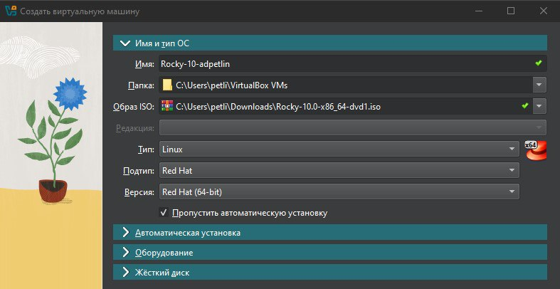{#fig:001 width=100%}

:::
::: {.column width="30%"}

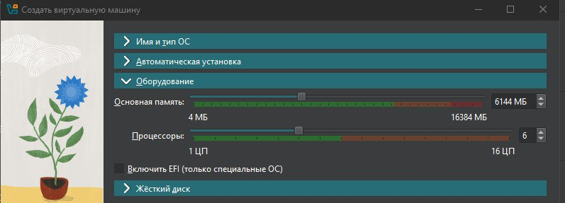{#fig:002 width=100%}

:::
::: {.column width="30%"}

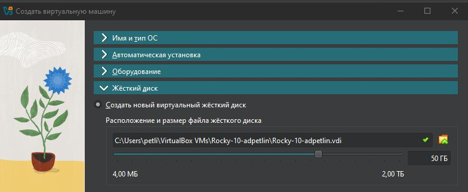{#fig:003 width=100%}

:::
::::::::::::::

## Ход работы

:::::::::::::: {.columns align=center}
::: {.column width="12%"}

Производим конфигурацию утсановки операционной системы

:::
::: {.column width="22%"}

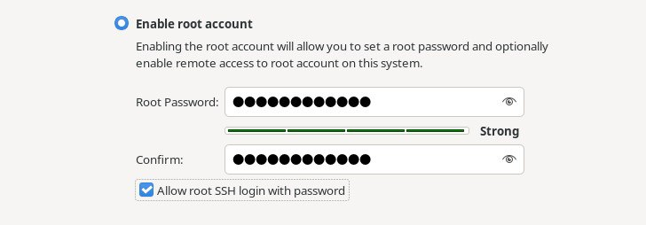{#fig:004 width=100%}

:::
::: {.column width="22%"}

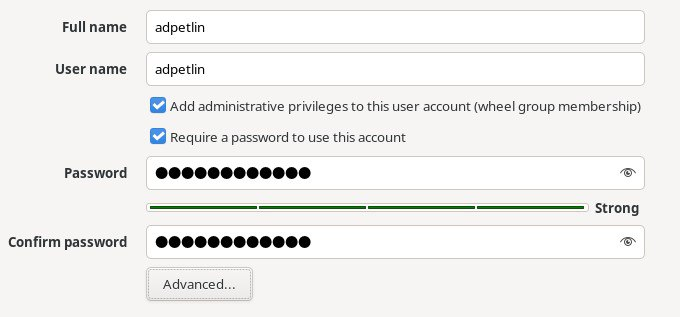{#fig:005 width=100%}

:::
::: {.column width="22%"}

{#fig:006 width=100%}

:::
::: {.column width="22%"}

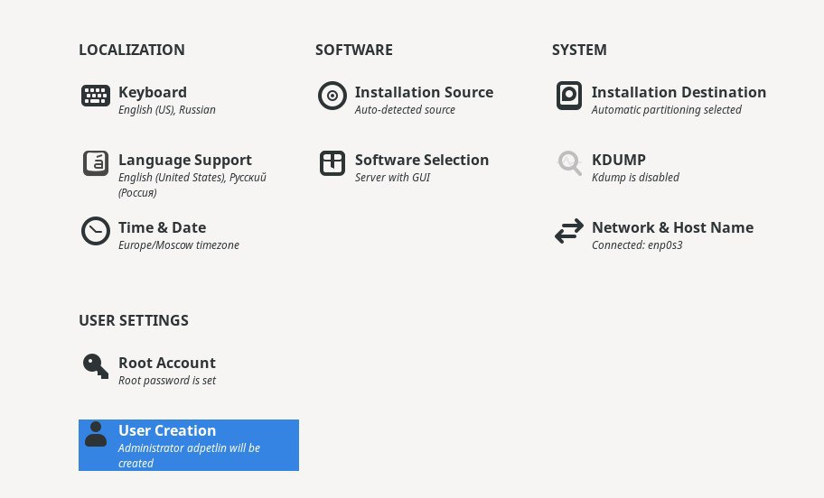{#fig:007 width=100%}

:::
::::::::::::::

## Ход работы

:::::::::::::: {.columns align=center}
::: {.column width="30%"}

Подключаем образ диска дополнений гостевой ОС

:::
::: {.column width="70%"}

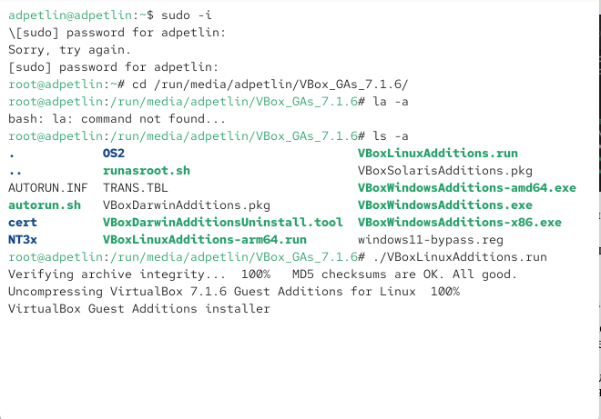{#fig:008 width=100%}

:::
::::::::::::::

# Домашнее задание

## Ход работы

:::::::::::::: {.columns align=center}
::: {.column width="30%"}

Анализируем последовательность загрузки системы, выполнив команду dmesg: информация об ОС; загрузка BIOS'a; загрузка процессора, портов, служб; загрузка системы; подгрузка virtualbox.

:::
::: {.column width="70%"}

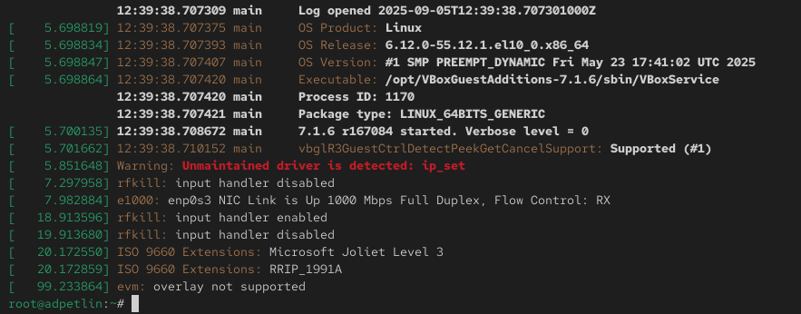{#fig:009 width=100%}

:::
::::::::::::::

## Ход работы

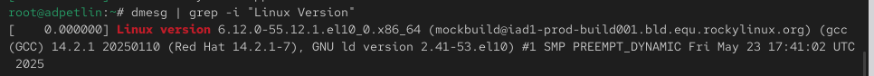{#fig:010 width=100%}

Можно использовать поиск с помощью grep: dmesg | grep -i "то, что ищем". Узнаем версию ядра Linux.

## Ход работы

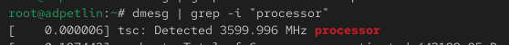{#fig:011 width=100%}

Узнаем частоту процессора.

## Ход работы

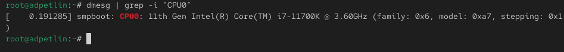{#fig:012 width=100%}

Узнаем модель процессора.

## Ход работы

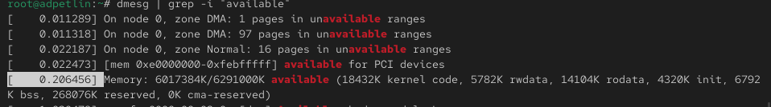{#fig:013 width=100%}

Узнаем объём доступной оперативной памяти.

## Ход работы

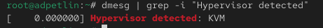{#fig:014 width=100%}

Узнаем тип обнаруженного гипервизора.

## Ход работы

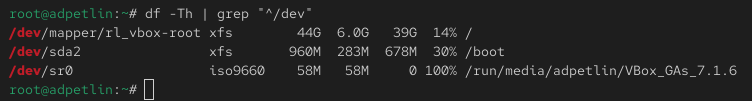{#fig:015 width=100%}

Узнаем тип файловой системы корневого раздела.

## Ход работы

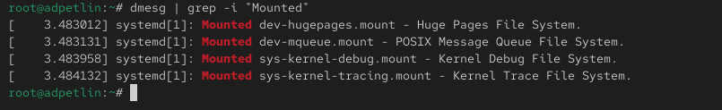{#fig:016 width=100%}

Узнаем последовательность монтирования файловых систем.

# Выводы

Мы приобрели практические навыки установки операционной системы на виртуальную машину, настройки минимально необходимых для дальнейшей работы сервисов.

# Список литературы{.unnumbered}

::: {.refs}
1. Купер М. Искусство программирования на языке сценариев командной оболочки. —
2004. — URL: https://www.opennet.ru/docs/RUS/bash_scripting_guide/.
2. Newham C. Learning the bash Shell: Unix Shell Programming. — O’Reilly Media, 2005. —
(In a Nutshell).
3. Робачевский А., Немнюгин С., Стесик О. Операционная система UNIX. — 2-е изд. —
БХВ-Петербург, 2010.
4. Колисниченко Д. Н. Самоучитель системного администратора Linux. — СПб. : БХВ-
Петербург, 2011. — (Системный администратор).
5. Dash P. Getting Started with Oracle VM VirtualBox. — Packt Publishing Ltd, 2013.
6. Colvin H. VirtualBox: An Ultimate Guide Book on Virtualization with VirtualBox. — Cre-
ateSpace Independent Publishing Platform, 2015.
7. Таненбаум Э., Бос Х. Современные операционные системы. — 4-е изд. — СПб. : Питер,
2015. — (Классика Computer Science).
8. GNU Bash Manual. — 2016. — URL: https : / / www . gnu . org / software / bash /
manual/.
9. Robbins A. Bash Pocket Reference. — O’Reilly Media, 2016.
10. Vugt S. van. Red Hat RHCSA/RHCE 7 cert guide : Red Hat Enterprise Linux 7 (EX200 and
EX300). — Pearson IT Certification, 2016. — (Certification Guide).
11. Zarrelli G. Mastering Bash. — Packt Publishing, 2017.
12. Unix и Linux: руководство системного администратора / Э. Немет, Г. Снайдер, Т.
Хейн, Б. Уэйли, Д. Макни. — 5-е изд. — СПб. : ООО «Диалектика», 2020.
:::
