---
## Front matter
title: "Отчёт по лабораторной работе №1"
author: "Петлин Артём Дмитриевич"

## Generic otions
lang: ru-RU
toc-title: "Содержание"

## Bibliography
bibliography: bib/cite.bib
csl: pandoc/csl/gost-r-7-0-5-2008-numeric.csl

## Pdf output format
toc: true # Table of contents
toc-depth: 2
lof: true # List of figures
lot: true # List of tables
fontsize: 12pt
linestretch: 1.5
papersize: a4
documentclass: scrreprt
## I18n polyglossia
polyglossia-lang:
  name: russian
  options:
	- spelling=modern
	- babelshorthands=true
polyglossia-otherlangs:
  name: english
## I18n babel
babel-lang: russian
babel-otherlangs: english
## Fonts
mainfont: IBM Plex Serif
romanfont: IBM Plex Serif
sansfont: IBM Plex Sans
monofont: IBM Plex Mono
mathfont: STIX Two Math
mainfontoptions: Ligatures=Common,Ligatures=TeX,Scale=0.94
romanfontoptions: Ligatures=Common,Ligatures=TeX,Scale=0.94
sansfontoptions: Ligatures=Common,Ligatures=TeX,Scale=MatchLowercase,Scale=0.94
monofontoptions: Scale=MatchLowercase,Scale=0.94,FakeStretch=0.9
mathfontoptions:
## Biblatex
biblatex: true
biblio-style: "gost-numeric"
biblatexoptions:
  - parentracker=true
  - backend=biber
  - hyperref=auto
  - language=auto
  - autolang=other*
  - citestyle=gost-numeric
## Pandoc-crossref LaTeX customization
figureTitle: "Рис."
tableTitle: "Таблица"
listingTitle: "Листинг"
lofTitle: "Список иллюстраций"
lotTitle: "Список таблиц"
lolTitle: "Листинги"
## Misc options
indent: true
header-includes:
  - \usepackage{indentfirst}
  - \usepackage{float} # keep figures where there are in the text
  - \floatplacement{figure}{H} # keep figures where there are in the text
---

# Цель работы

Целью данной работы является приобретение практических навыков установки опера-
ционной системы на виртуальную машину, настройки минимально необходимых для
дальнейшей работы сервисов.

# Задание

Установка операционной системы на виртуальную машину.

# Теоретическое введение

абораторная работа подразумевает установку на виртуальную машину VirtualBox
(https://www.virtualbox.org/) операционной системы Linux (дистрибутив Rocky
(https://rockylinux.org/).
Выполнение работы возможно как в дисплейном классе факультета физико-
математических и естественных наук РУДН, так и дома. Описание выполнения работы
приведено для техники дисплейного класса со следующими характеристиками:
– 8 GB оперативной памяти, 40 GB свободного места на жёстком диске;
– ОС Linux Gentoo (http://www.gentoo.ru/);
– VirtualBox верс. 7.0 или старше;
– сетевой каталог с образами ОС для работающих в дисплейном классе:
/afs/dk.sci.pfu.edu.ru/common/files/iso/.

# Выполнение лабораторной работы

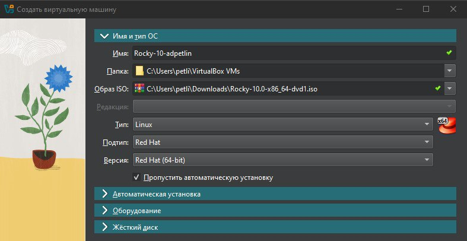{#fig:001 width=100%}

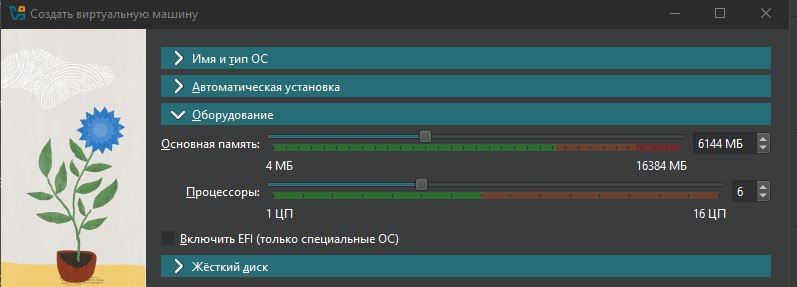{#fig:002 width=100%}

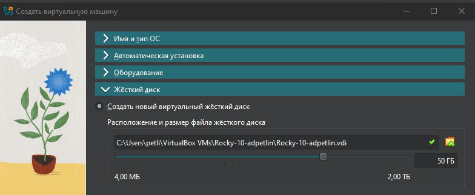{#fig:003 width=100%}

Создаем новую виртуальную машины и настраиваем ее

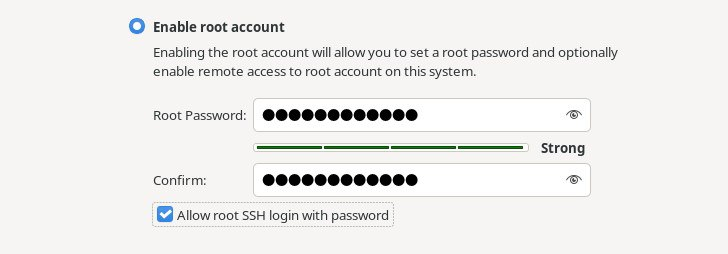{#fig:004 width=100%}

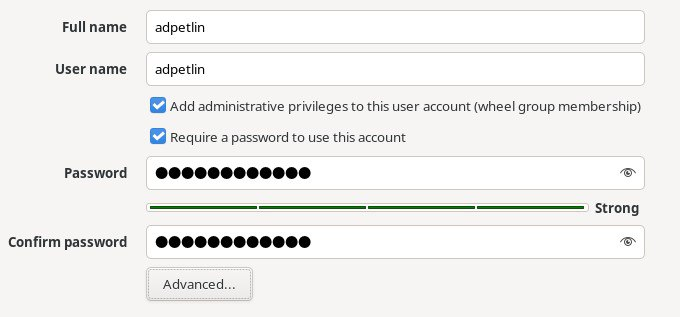{#fig:005 width=100%}

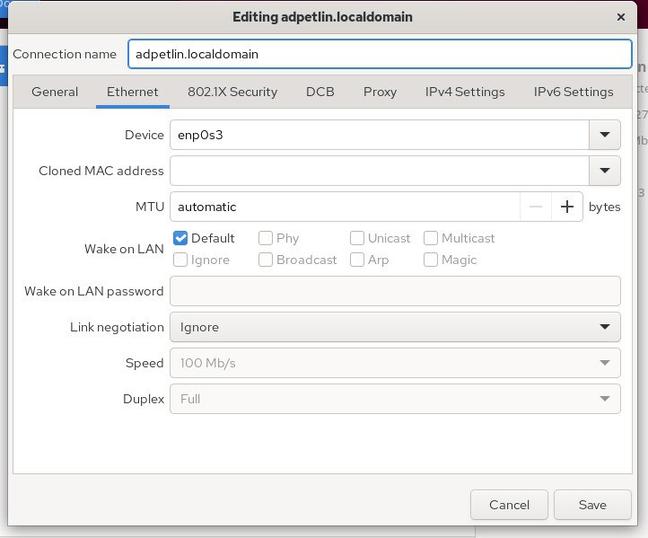{#fig:006 width=100%}

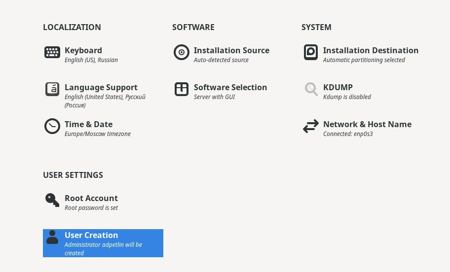{#fig:007 width=100%}

Производим конфигурацию утсановки операционной системы

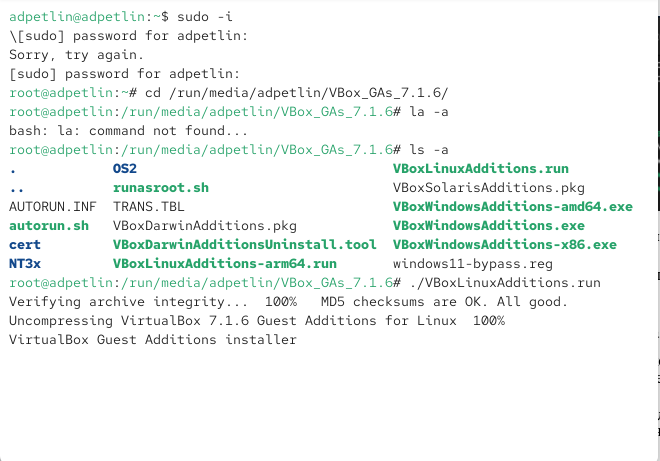{#fig:008 width=100%}

Подключаем образ диска дополнений гостевой ОС

# Домашнее задание

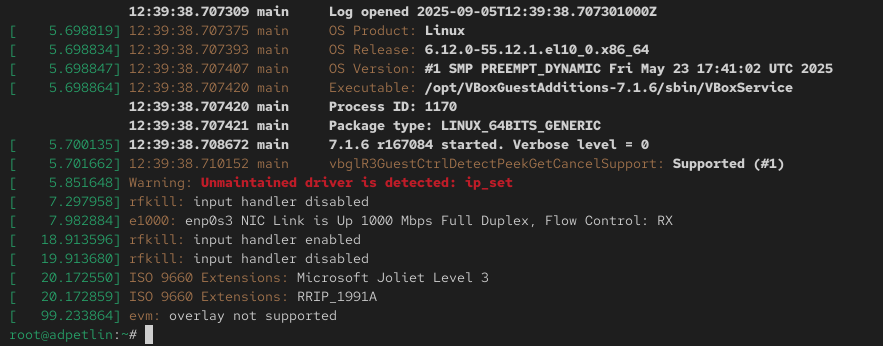{#fig:009 width=100%}

Анализируем последовательность загрузки системы, выполнив команду dmesg: информация об ОС; загрузка BIOS'a; загрузка процессора, портов, служб; загрузка системы; подгрузка virtualbox.

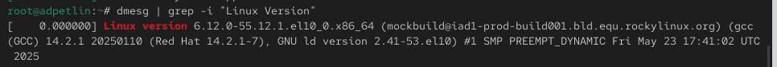{#fig:010 width=100%}

Можно использовать поиск с помощью grep: dmesg | grep -i "то, что ищем". Узнаем версию ядра Linux.

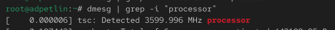{#fig:011 width=100%}

Узнаем частоту процессора.

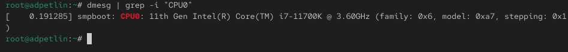{#fig:012 width=100%}

Узнаем модель процессора.

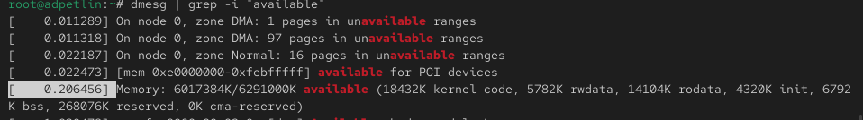{#fig:013 width=100%}

Узнаем объём доступной оперативной памяти.

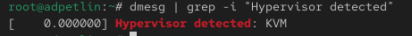{#fig:014 width=100%}

Узнаем тип обнаруженного гипервизора.

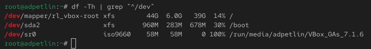{#fig:015 width=100%}

Узнаем тип файловой системы корневого раздела.

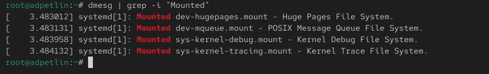{#fig:016 width=100%}

Узнаем последовательность монтирования файловых систем.

# Выводы

Мы приобрели практические навыки установки операционной системы на виртуальную машину, настройки минимально необходимых для дальнейшей работы сервисов.

# Список литературы{.unnumbered}

::: {.refs}
1. Купер М. Искусство программирования на языке сценариев командной оболочки. —
2004. — URL: https://www.opennet.ru/docs/RUS/bash_scripting_guide/.
2. Newham C. Learning the bash Shell: Unix Shell Programming. — O’Reilly Media, 2005. —
(In a Nutshell).
3. Робачевский А., Немнюгин С., Стесик О. Операционная система UNIX. — 2-е изд. —
БХВ-Петербург, 2010.
4. Колисниченко Д. Н. Самоучитель системного администратора Linux. — СПб. : БХВ-
Петербург, 2011. — (Системный администратор).
5. Dash P. Getting Started with Oracle VM VirtualBox. — Packt Publishing Ltd, 2013.
6. Colvin H. VirtualBox: An Ultimate Guide Book on Virtualization with VirtualBox. — Cre-
ateSpace Independent Publishing Platform, 2015.
7. Таненбаум Э., Бос Х. Современные операционные системы. — 4-е изд. — СПб. : Питер,
2015. — (Классика Computer Science).
8. GNU Bash Manual. — 2016. — URL: https : / / www . gnu . org / software / bash /
manual/.
9. Robbins A. Bash Pocket Reference. — O’Reilly Media, 2016.
10. Vugt S. van. Red Hat RHCSA/RHCE 7 cert guide : Red Hat Enterprise Linux 7 (EX200 and
EX300). — Pearson IT Certification, 2016. — (Certification Guide).
11. Zarrelli G. Mastering Bash. — Packt Publishing, 2017.
12. Unix и Linux: руководство системного администратора / Э. Немет, Г. Снайдер, Т.
Хейн, Б. Уэйли, Д. Макни. — 5-е изд. — СПб. : ООО «Диалектика», 2020.
:::
