---
# Preamble

## Author
author:
  name: Артём Дмитриевич Петлин
  degrees: Student
  orcid: 0000-0002-0877-7063
  email: 1132246846@pfur.ru
  affiliation:
    - name: Российский университет дружбы народов
      country: Российская Федерация
      postal-code: 117198
      city: Москва
      address: ул. Миклухо-Маклая, д. 6
## Title
title: Лабораторная работа №13
license: CC BY
date: 2025-11-29
## Generic options
lang: ru-RU
crossref:
  lof-title: Список иллюстраций
  lot-title: Список таблиц
  lol-title: Листинги
## Formats
format:
### Pdf output format
  beamer:
    toc: true
    toc-title: Содержание
    number-sections: true
    colorlinks: false
    toc-depth: 2
    slide_level: 2
    aspectratio: 169
    section-titles: true
    theme: metropolis
    themeoptions: progressbar=frametitle,sectionpage=progressbar,numbering=fraction
#### Language
    babel-lang: russian
    babel-otherlangs: english
### Html output
  revealjs:
    transition: slide
    margin: 0.2
    smaller: false
    output-ext: html
    theme: beige
    logo: _resources/image/logo_rudn.png
---

# Информация

## Докладчик

:::::::::::::: {.columns align=center}
::: {.column width="70%"}

  * Петлин Артём Дмитриевич
  * студент
  * группа НПИбд-02-24
  * Российский университет дружбы народов
  * [1132246846@pfur.ru](mailto:1132246846@pfur.ru)
  * <https://github.com/hikrim/study_2025-2026_os2>

:::
::: {.column width="30%"}

:::
::::::::::::::

# Цель работы

## Цель работы

Получить навыки настройки пакетного фильтра в Linux.

# Задание

## Задание

1. Используя firewall-cmd:

- определить текущую зону по умолчанию
- определить доступные для настройки зоны
- определить службы, включённые в текущую зону
- добавить сервер VNC в конфигурацию брандмауэра.

2. Используя firewall-config:

- добавьте службы http и ssh в зону public
- добавьте порт 2022 протокола UDP в зону public
- добавьте службу ftp.

3. Выполните задание для самостоятельной работы (раздел 13.5).

# Теоретическое введение

## Теоретическое введение

Управление межсетевым экраном firewalld осуществляет через настройки доверенных зон сетевых соединений или конкретных интерфейсов. В данном случае под зоной
понимается набор правил, применяемых к входящим в систему пакетам, соответствующим конкретному адресу источника или сетевому интерфейсу. Firewalld работает только
с входящими пакетами, фильтрация на исходящих пакетах не проводится. Использование зон особенно важно на серверах с несколькими интерфейсами. На таких серверах
зоны позволяют администраторам достаточно легко назначать определённый набор
правил обработки входящих пакетов.

# Выполнение лабораторной работы

## Ход работы

:::::::::::::: {.columns align=center}
::: {.column width="50%"}

Получаем полномочия администратора. Определяем текущую активную зону брандмауэра по умолчанию. Изучаем список всех доступных для настройки зон безопасности. Просматриваем перечень всех предопределенных служб, которые можно добавлять в правила брандмауэра.

:::
::: {.column width="50%"}

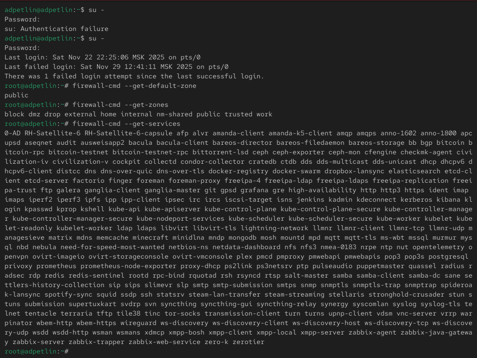{#fig-001 width=100%}

:::
::::::::::::::	

## Ход работы

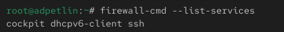{#fig-002 width=100%}

Проверяем, какие службы уже разрешены в текущей активной зоне.

## Ход работы

:::::::::::::: {.columns align=center}
::: {.column width="50%"}

Сравниваем детальную информацию о текущей зоне и зоне public, анализируя различия в настройках.

:::
::: {.column width="50%"}

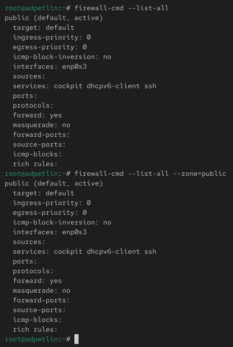{#fig-003 width=100%}

:::
::::::::::::::

## Ход работы

:::::::::::::: {.columns align=center}
::: {.column width="50%"}

Добавляем службу VNC-сервера в текущую конфигурацию брандмауэра. Проверяем успешность добавления службы, просматривая общую конфигурацию.

:::
::: {.column width="50%"}

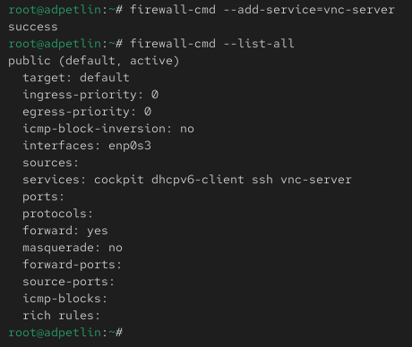{#fig-004 width=100%}

:::
::::::::::::::

## Ход работы

:::::::::::::: {.columns align=center}
::: {.column width="50%"}

Перезапускаем службу брандмауэра для применения изменений. Снова проверяем конфигурацию и анализируем, почему добавленная служба VNC отсутствует в списке. После перезапуска службы firewalld добавленная служба VNC-server исчезает из конфигурации, потому что изменения были внесены только во временную (runtime) конфигурацию, которая сбрасывается при перезагрузке службы.

:::
::: {.column width="50%"}

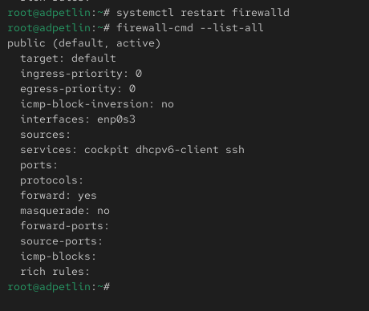{#fig-005 width=100%}

:::
::::::::::::::

## Ход работы

:::::::::::::: {.columns align=center}
::: {.column width="50%"}

Повторно добавляем службу VNC-server, но теперь с параметром постоянного сохранения. Проверяем конфигурацию и наблюдаем, что служба все еще не отображается в активных правилах. Службы, добавленные с параметром --permanent, сохраняются в постоянной конфигурации на диске, но не автоматически активируются в текущей сессии.

:::
::: {.column width="50%"}

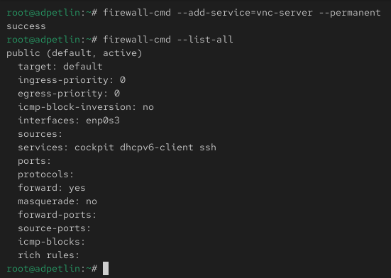{#fig-006 width=100%}

:::
::::::::::::::

## Ход работы

:::::::::::::: {.columns align=center}
::: {.column width="50%"}

Перезагружаем конфигурацию брандмауэра и проверяем, что служба VNC-server теперь присутствует в активных правилах. 

:::
::: {.column width="50%"}

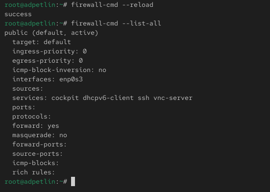{#fig-007 width=100%}

:::
::::::::::::::

## Ход работы

:::::::::::::: {.columns align=center}
::: {.column width="50%"}

Добавляем в постоянную конфигурацию порт 2022 протокола TCP и применяем изменения. Проверяем, что порт успешно добавлен в конфигурацию.

:::
::: {.column width="50%"}

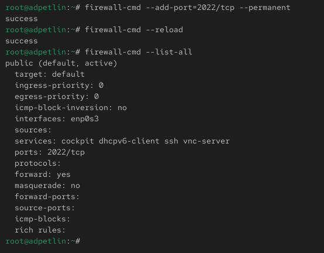{#fig-008 width=100%}

:::
::::::::::::::

## Ход работы

:::::::::::::: {.columns align=center}
::: {.column width="34%"}

Запускаем графический интерфейс управления брандмауэром под учетной записью пользователя с административными правами. Переключаемся в режим постоянной конфигурации, чтобы все изменения сохранялись после перезагрузки. В зоне public отмечаем для включения службы HTTP, HTTPS и FTP.

:::
::: {.column width="33%"}

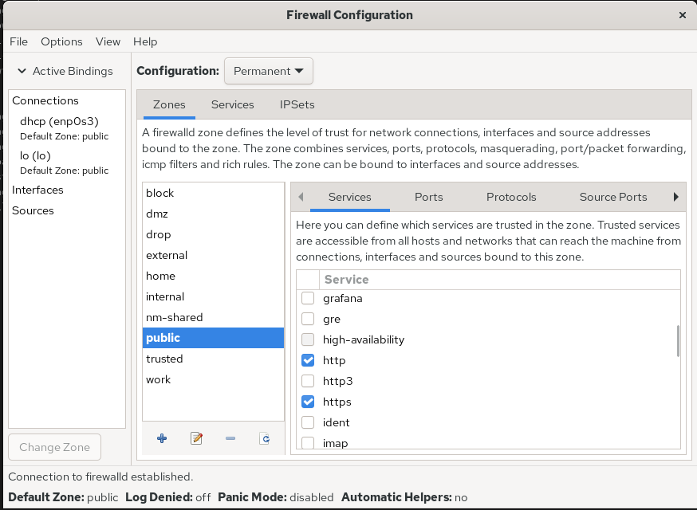{#fig-009 width=100%}

:::
::: {.column width="33%"}

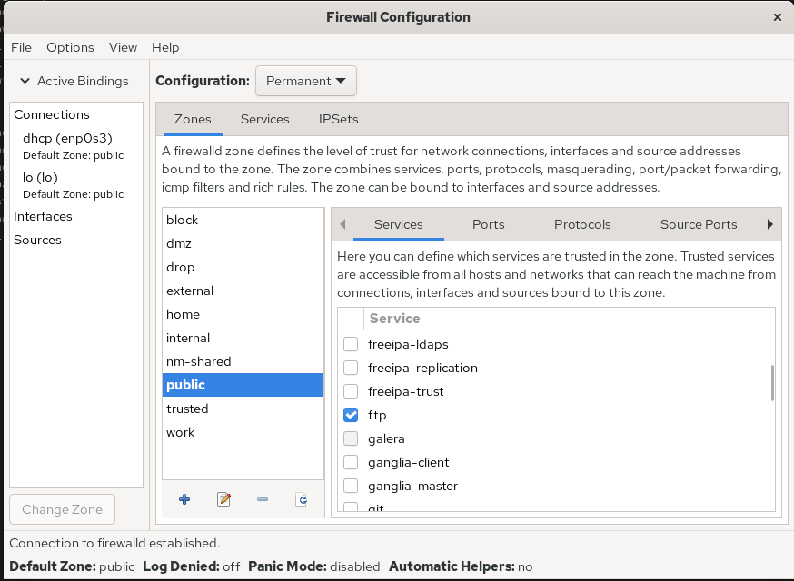{#fig-010 width=100%}

:::
::::::::::::::

## Ход работы

:::::::::::::: {.columns align=center}
::: {.column width="50%"}

На вкладке портов добавляем порт 2022 с протоколом UDP. Закрываем утилиту настройки.

:::
::: {.column width="50%"}

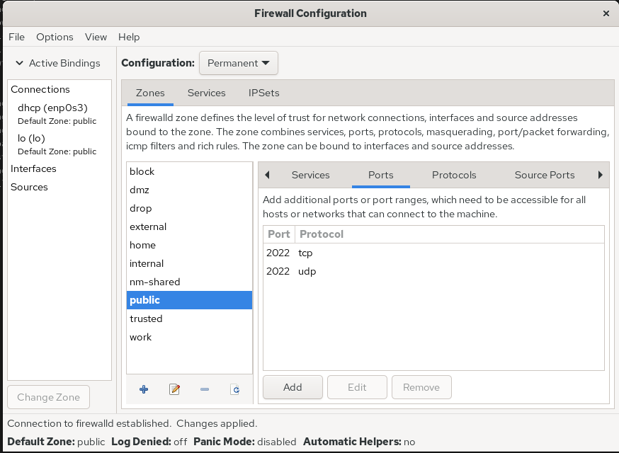{#fig-011 width=100%}

:::
::::::::::::::

## Ход работы

:::::::::::::: {.columns align=center}
::: {.column width="50%"}

Проверяем текущую активную конфигурацию и отмечаем, что внесенные изменения еще не применены. Изменения, внесенные в графическом интерфейсе в режиме permanent, требуют перезагрузки конфигурации для активации в текущей сессии. 

:::
::: {.column width="50%"}

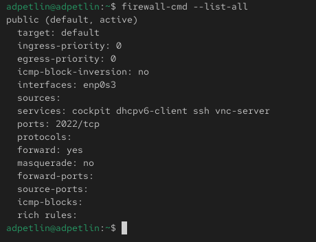{#fig-012 width=100%}

:::
::::::::::::::

## Ход работы

:::::::::::::: {.columns align=center}
::: {.column width="50%"}

Перезагружаем конфигурацию брандмауэра и проверяем, что все добавленные службы и порты теперь активны.

:::
::: {.column width="50%"}

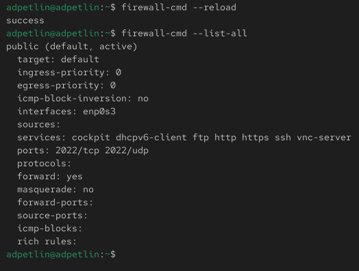{#fig-013 width=100%}

:::
::::::::::::::

# Самостоятельная работа

## Ход работы

:::::::::::::: {.columns align=center}
::: {.column width="50%"}

Создаем конфигурацию межсетевого экрана, разрешающую доступ к службам telnet, imap, pop3 и smtp. Настраиваем службу telnet через командную строку.

:::
::: {.column width="50%"}

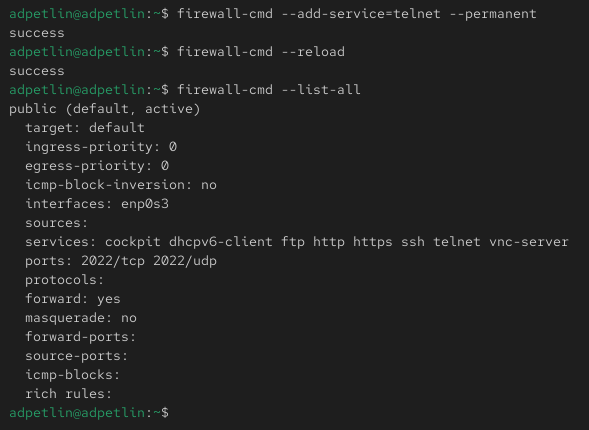{#fig-014 width=100%}

:::
::::::::::::::

## Ход работы

:::::::::::::: {.columns align=center}
::: {.column width="50%"}

Службы imap, pop3 и smtp - через графический интерфейс.

:::
::: {.column width="50%"}

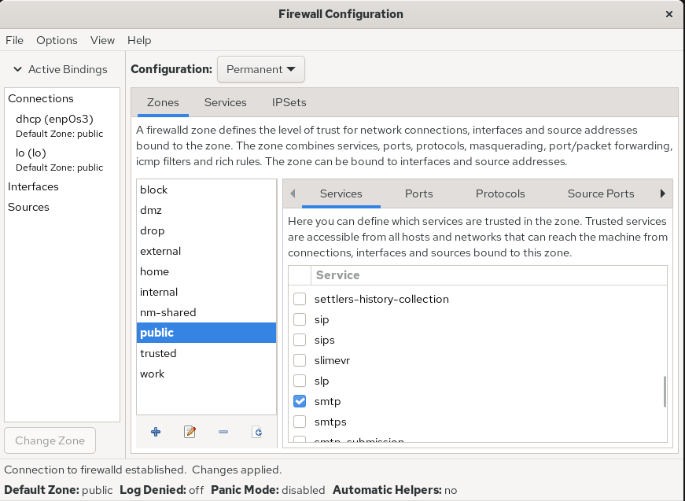{#fig-015 width=100%}

:::
::::::::::::::

## Ход работы

:::::::::::::: {.columns align=center}
::: {.column width="50%"}

Убеждаемся, что конфигурация является постоянной и сохраняется после перезагрузки системы.

:::
::: {.column width="50%"}

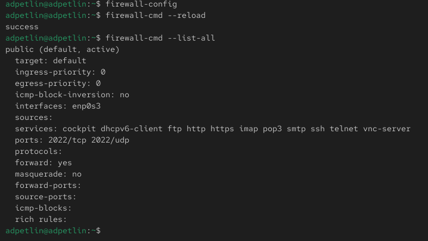{#fig-016 width=100%}

:::
::::::::::::::

## Ход работы

:::::::::::::: {.columns align=center}
::: {.column width="50%"}

После перезагрузки системы.

:::
::: {.column width="50%"}

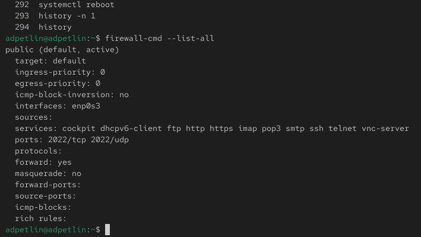{#fig-017 width=100%}

:::
::::::::::::::

# Ответы на контрольные вопросы

## Ответы на контрольные вопросы

1. Какая служба должна быть запущена перед началом работы с менеджером конфигурации брандмауэра firewall-config?
Перед работой с firewall-config должна быть запущена служба firewalld. Проверяем это командой systemctl status firewalld.

2. Какая команда позволяет добавить UDP-порт 2355 в конфигурацию брандмауэра в зоне по умолчанию?
Команда: firewall-cmd --add-port=2355/udp --permanent с последующей перезагрузкой конфигурации.

3. Какая команда позволяет показать всю конфигурацию брандмауэра во всех зонах?
Команда: firewall-cmd --list-all-zones отображает полную конфигурацию всех зон.

## Ответы на контрольные вопросы

4. Какая команда позволяет удалить службу vnc-server из текущей конфигурации брандмауэра?
Команда: firewall-cmd --remove-service=vnc-server --permanent с последующей перезагрузкой.

5. Какая команда firewall-cmd позволяет активировать новую конфигурацию, добавленную опцией --permanent?
Команда: firewall-cmd --reload активирует все изменения, сохраненные с параметром --permanent.

6. Какой параметр firewall-cmd позволяет проверить, что новая конфигурация была добавлена в текущую зону и теперь активна?
Команда: firewall-cmd --list-all показывает текущую активную конфигурацию зоны.

## Ответы на контрольные вопросы

7. Какая команда позволяет добавить интерфейс eno1 в зону public?
Команда: firewall-cmd --zone=public --add-interface=eno1 --permanent

8. Если добавить новый интерфейс в конфигурацию брандмауэра, пока не указана зона, в какую зону он будет добавлен?
Новый интерфейс автоматически добавляется в зону по умолчанию (обычно public), если для него явно не указана другая зона.

# Выводы

## Выводы

Мы получили навыки настройки пакетного фильтра в Linux.

# Список литературы{.unnumbered}

## Список литературы{.unnumbered}

::: {.refs}
1. Purdy G. N. Linux iptables Pocket Reference. — O’Reilly Media, 2004. — (Pocket Reference).
2. Колисниченко Д. Н. Самоучитель системного администратора Linux. — СПб. : БХВ-
Петербург, 2011. — (Системный администратор).
3. Vugt S. van. Red Hat RHCSA/RHCE 7 cert guide : Red Hat Enterprise Linux 7 (EX200 and
EX300). — Pearson IT Certification, 2016. — (Certification Guide).
4. Динамический брандмауэр с использованием FirewallD. — URL: https : / /
fedoraproject.org/wiki/FirewallD/ru.
:::

:::::::::::::: {.columns align=center}
::: {.column width="50%"}

:::
::: {.column width="50%"}

:::
::::::::::::::
