---
# Preamble

## Author
author:
  name: Артём Дмитриевич Петлин
  degrees: Student
  orcid: 0000-0002-0877-7063
  email: 1132246846@pfur.ru
  affiliation:
    - name: Российский университет дружбы народов
      country: Российская Федерация
      postal-code: 117198
      city: Москва
      address: ул. Миклухо-Маклая, д. 6
## Title
title: Лабораторная работа №14
license: CC BY
date: 2025-12-06
## Generic options
lang: ru-RU
crossref:
  lof-title: Список иллюстраций
  lot-title: Список таблиц
  lol-title: Листинги
## Formats
format:
### Pdf output format
  beamer:
    toc: true
    toc-title: Содержание
    number-sections: true
    colorlinks: false
    toc-depth: 2
    slide_level: 2
    aspectratio: 169
    section-titles: true
    theme: metropolis
    themeoptions: progressbar=frametitle,sectionpage=progressbar,numbering=fraction
#### Language
    babel-lang: russian
    babel-otherlangs: english
### Html output
  revealjs:
    transition: slide
    margin: 0.2
    smaller: false
    output-ext: html
    theme: beige
    logo: _resources/image/logo_rudn.png
---

# Информация

## Докладчик

:::::::::::::: {.columns align=center}
::: {.column width="70%"}

  * Петлин Артём Дмитриевич
  * студент
  * группа НПИбд-02-24
  * Российский университет дружбы народов
  * [1132246846@pfur.ru](mailto:1132246846@pfur.ru)
  * <https://github.com/hikrim/study_2025-2026_os2>

:::
::: {.column width="30%"}

:::
::::::::::::::

# Цель работы

## Цель работы

Получить навыки создания разделов на диске и файловых систем. Получить навыки
монтирования файловых систем.

# Задание

## Задание

1. Добавьте два диска на виртуальной машине.
2. Продемонстрируйте навыки создания разделов MBR с помощью fdisk.
3. Продемонстрируйте навыки создания логических разделов с помощью fdisk.
4. Продемонстрируйте навыки создания раздела подкачки с помощью fdisk.
5. Продемонстрируйте навыки создания разделов GPT с помощью gdisk.
6. Продемонстрируйте навыки форматирования файловой системы XFS.
7. Продемонстрируйте навыки форматирования файловой системы EXT4.
8. Продемонстрируйте навыки ручного монтирования файловых систем.
9. Продемонстрируйте навыки монтирования файловых систем с помощью /etc/fstab.
10. Выполните задание для самостоятельной работы.

# Теоретическое введение

## Теоретическое введение

Наиболее распространённой системой разметки дискового пространства для компьютеров x86 до недавнего времени была MBR (Master Boot Record). MBR предполагает
размещение загрузчика системы и таблицы разделов в первом секторе диска.  

В ОС типа Linux существуют разные способы разметки дискового пространства, создания и просмотра на нём разделов. Наиболее простой утилитой для работы с дисковым
пространством из командной строки является fdisk.  

Утилита gdisk (или GPT fdisk) представляет собой интерактивный манипулятор
таблицами разделов GUID (GPT). Утилита gdisk работает с таблицей разделов (GPT)
с глобальным уникальным идентификатором (GUID) дисков, а не с таблицами разделов
с основной загрузочной записью (Master Boot Record, MBR). Утилита gdisk использует пользовательский интерфейс, похожий на fdisk, но в отличие от fdisk изменяет
разделы GPT.

# Выполнение лабораторной работы

## Ход работы

:::::::::::::: {.columns align=center}
::: {.column width="50%"}

Запускаем виртуальную машину с добавленными дисками. Получаем полномочия администратора и просматриваем список всех доступных дисков и их разделов.

:::
::: {.column width="50%"}

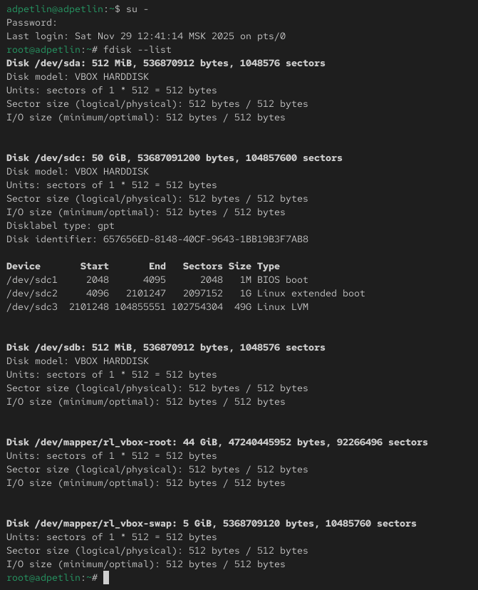{#fig-001 width=100%}

:::
::::::::::::::

## Ход работы

:::::::::::::: {.columns align=center}
::: {.column width="50%"}

Запускаем утилиту fdisk для работы с первым дополнительным диском. Изучаем доступные команды в интерактивном режиме fdisk. Проверяем текущее распределение дискового пространства.

:::
::: {.column width="50%"}

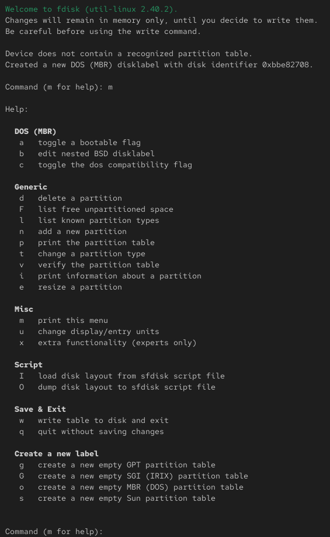{#fig-002 width=100%}

:::
::::::::::::::

## Ход работы

:::::::::::::: {.columns align=center}
::: {.column width="50%"}

Создаем новый основной раздел. Выбираем начальный сектор раздела. Указываем размер раздела, оставляя свободное место для других разделов. 

:::
::: {.column width="50%"}

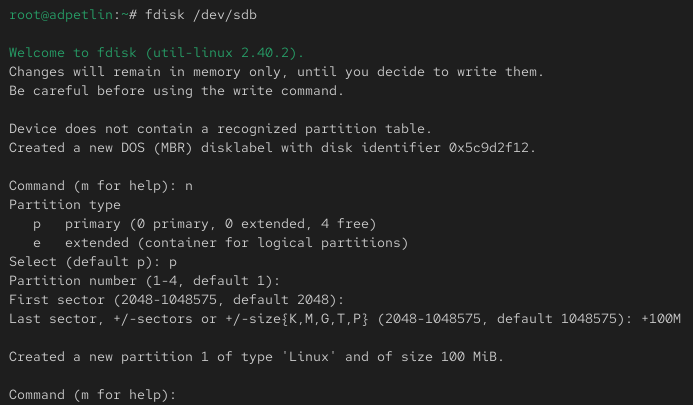{#fig-003 width=100%}

:::
::::::::::::::

## Ход работы

:::::::::::::: {.columns align=center}
::: {.column width="50%"}

Проверяем и при необходимости изменяем тип создаваемого раздела. Сохраняем изменения на диск.

:::
::: {.column width="50%"}

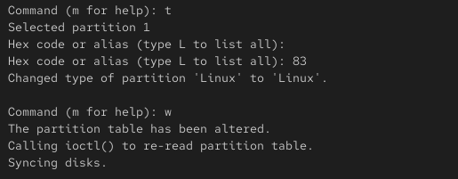{#fig-004 width=100%}

:::
::::::::::::::

## Ход работы

:::::::::::::: {.columns align=center}
::: {.column width="50%"}

Сравниваем информацию о разделах из разных источников. При сравнении вывода команд fdisk -l /dev/sdb и cat /proc/partitions наблюдаем, что команда fdisk показывает логическую структуру разделов, включая их типы и размеры, в то время как файл /proc/partitions отображает только базовую информацию о блочных устройствах, которую ядро использует для работы с разделами. Обновляем таблицу разделов в ядре системы.
 
:::
::: {.column width="50%"}

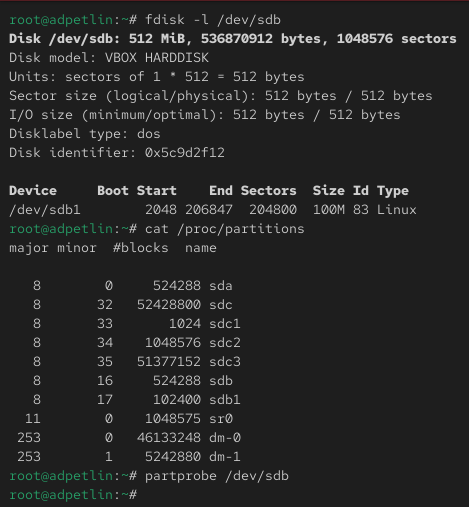{#fig-005 width=100%}

:::
::::::::::::::

## Ход работы

:::::::::::::: {.columns align=center}
::: {.column width="50%"}

Снова запускаем fdisk для того же диска. Создаем расширенный раздел, который заполняет оставшееся пространство диска. Внутри расширенного раздела создаем логический раздел. Сохраняем изменения и обновляем таблицу разделов.

:::
::: {.column width="50%"}

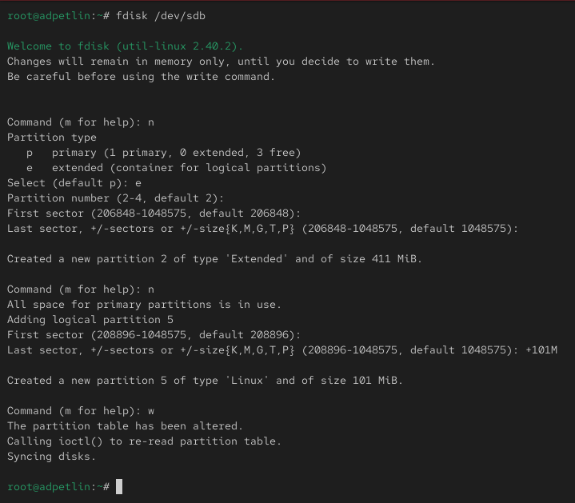{#fig-006 width=100%}

:::
::::::::::::::

## Ход работы

:::::::::::::: {.columns align=center}
::: {.column width="50%"}

Проверяем созданные разделы.

:::
::: {.column width="50%"}

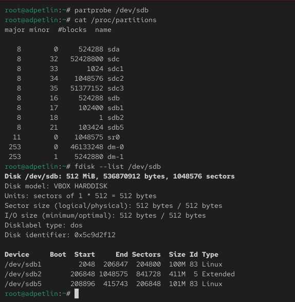{#fig-007 width=100%}

:::
::::::::::::::

## Ход работы

:::::::::::::: {.columns align=center}
::: {.column width="50%"}

Запускаем fdisk и создаем еще один логический раздел. Изменяем тип раздела на "Linux swap". Сохраняем изменения. 

:::
::: {.column width="50%"}

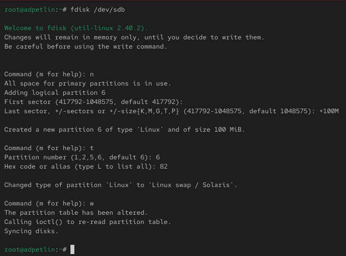{#fig-008 width=100%}

:::
::::::::::::::

## Ход работы

:::::::::::::: {.columns align=center}
::: {.column width="50%"}

Обновляем таблицу разделов. Проверяем созданные разделы.

:::
::: {.column width="50%"}

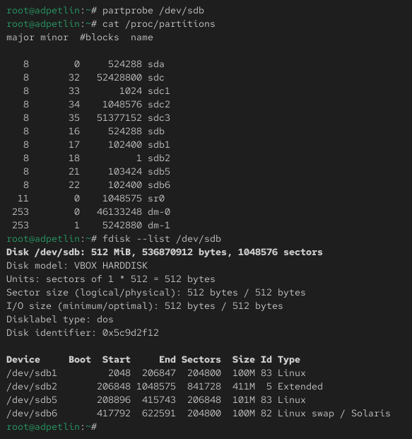{#fig-009 width=100%}

:::
::::::::::::::

## Ход работы

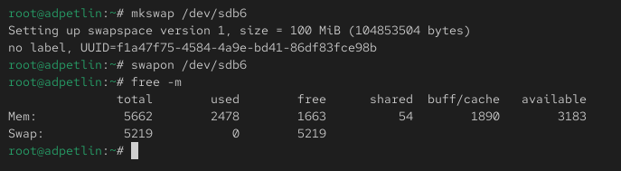{#fig-010 width=100%}

Форматируем раздел как пространство подкачки. Активируем раздел подкачки. Проверяем доступное пространство подкачки в системе.

## Ход работы

:::::::::::::: {.columns align=center}
::: {.column width="50%"}

Просматриваем информацию о втором дополнительном диске с GPT-разметкой.

:::
::: {.column width="50%"}

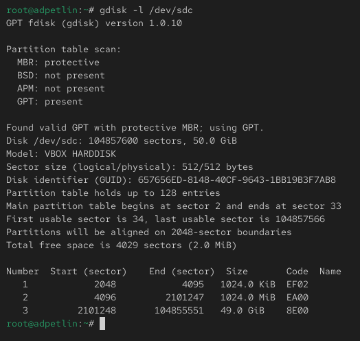{#fig-011 width=100%}

:::
::::::::::::::

## Ход работы

:::::::::::::: {.columns align=center}
::: {.column width="50%"}

Запускаем утилиту gdisk для создания разделов GPT. Создаем новый раздел с указанием его размера. Проверяем и устанавливаем тип раздела. Просматриваем планируемое разбиение диска. Сохраняем изменения.

:::
::: {.column width="50%"}

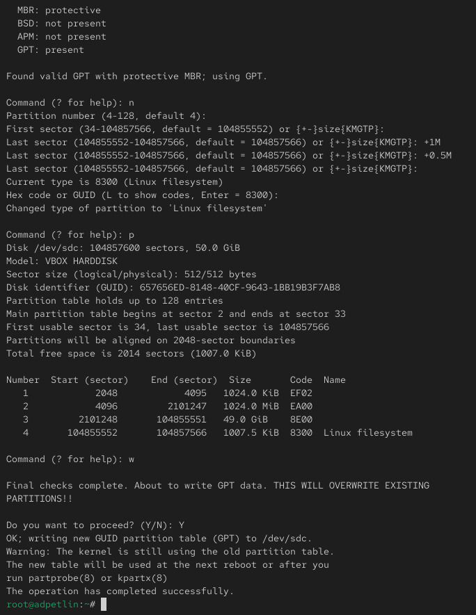{#fig-012 width=100%}

:::
::::::::::::::

## Ход работы

:::::::::::::: {.columns align=center}
::: {.column width="50%"}

Обновляем таблицу разделов. Проверяем созданные разделы.

:::
::: {.column width="50%"}

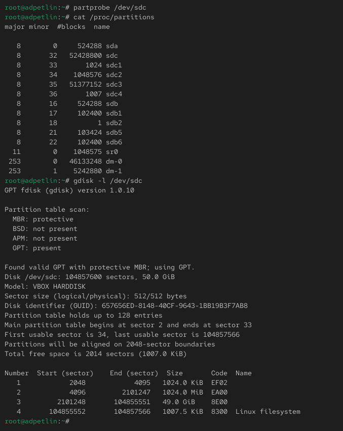{#fig-013 width=100%}

:::
::::::::::::::

## Ход работы

:::::::::::::: {.columns align=center}
::: {.column width="50%"}

Форматируем созданный раздел в файловую систему XFS. Устанавливаем метку для файловой системы.

:::
::: {.column width="50%"}

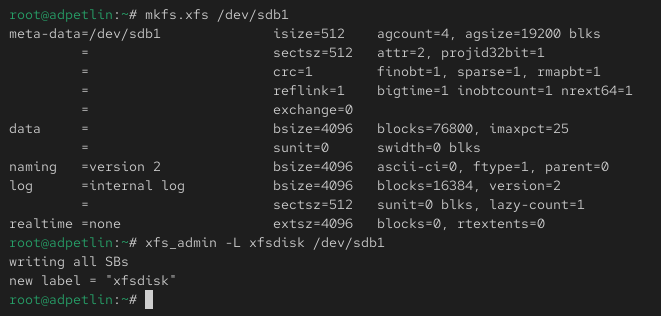{#fig-014 width=100%}

:::
::::::::::::::

## Ход работы

:::::::::::::: {.columns align=center}
::: {.column width="50%"}

Форматируем другой раздел в файловую систему EXT4. Устанавливаем метку для файловой системы. Настраиваем дополнительные параметры файловой системы.

:::
::: {.column width="50%"}

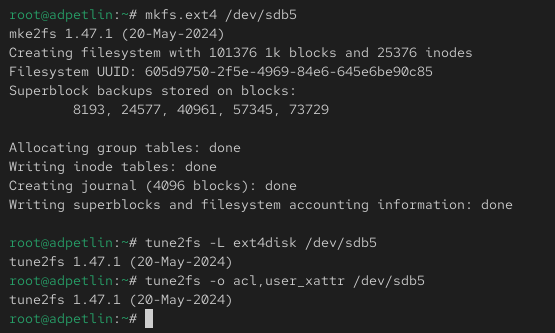{#fig-015 width=100%}

:::
::::::::::::::

## Ход работы

:::::::::::::: {.columns align=center}
::: {.column width="50%"}

Создаем точку монтирования в файловой системе. Вручную монтируем отформатированный раздел. Проверяем успешность монтирования.

:::
::: {.column width="50%"}

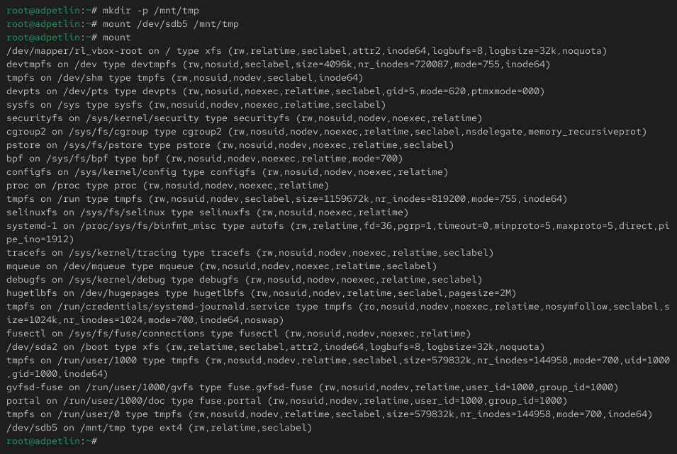{#fig-016 width=100%}

:::
::::::::::::::

## Ход работы

:::::::::::::: {.columns align=center}
::: {.column width="50%"}

Отмонтируем раздел. Подтверждаем, что раздел отмонтирован.

:::
::: {.column width="50%"}

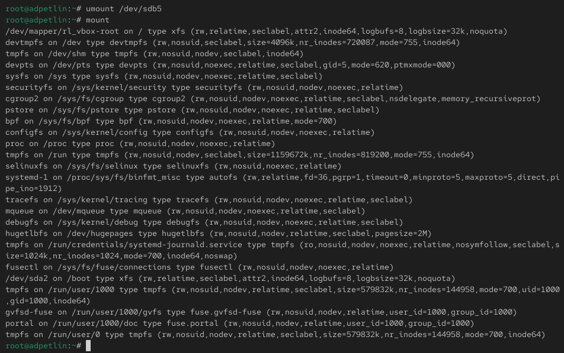{#fig-017 width=100%}

:::
::::::::::::::

## Ход работы

:::::::::::::: {.columns align=center}
::: {.column width="50%"}

Создаем точку монтирования для автоматического монтирования. Определяем UUID раздела, который будем монтировать. 

:::
::: {.column width="50%"}

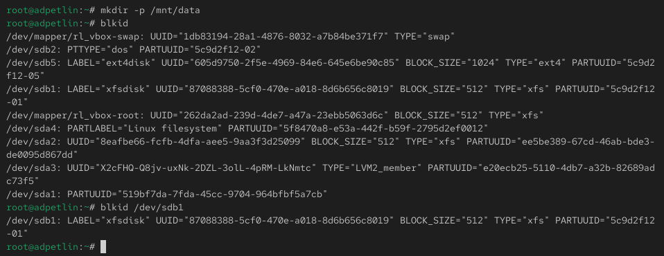{#fig-018 width=100%}

:::
::::::::::::::

## Ход работы

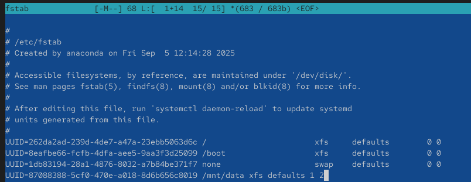{#fig-019 width=100%}

Добавляем запись в файл /etc/fstab для автоматического монтирования при загрузке.

## Ход работы

:::::::::::::: {.columns align=center}
::: {.column width="50%"}

Тестируем конфигурацию, монтируя все разделы из fstab. Проверяем, что раздел успешно примонтирован.

:::
::: {.column width="50%"}

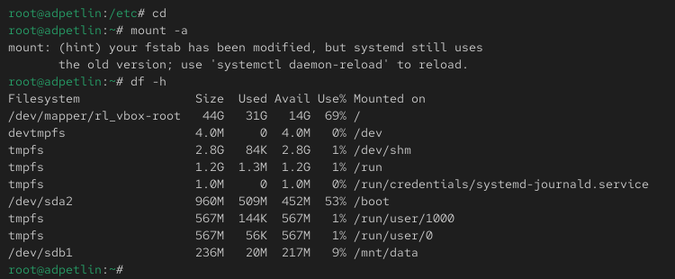{#fig-020 width=100%}

:::
::::::::::::::

# Самостоятельная работа

## Ход работы

:::::::::::::: {.columns align=center}
::: {.column width="50%"}

Создаем два раздела на GPT-диске

:::
::: {.column width="50%"}

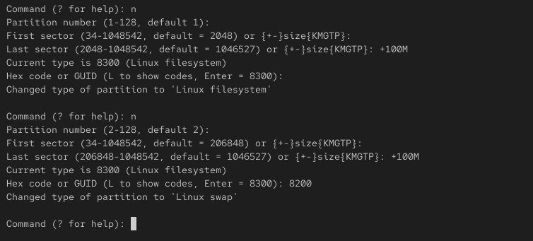{#fig-021 width=100%}

:::
::::::::::::::

## Ход работы

:::::::::::::: {.columns align=center}
::: {.column width="50%"}

Один для подкачки, другой с файловой системой EXT4.

:::
::: {.column width="50%"}

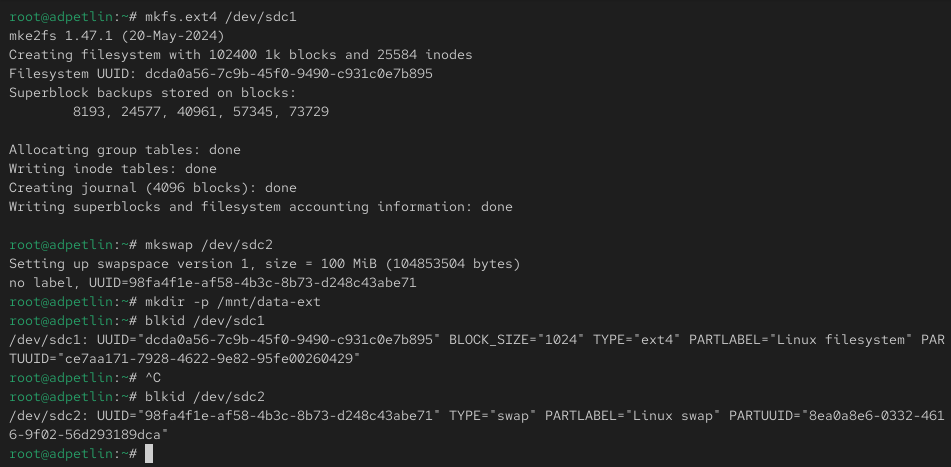{#fig-022 width=100%}

:::
::::::::::::::

## Ход работы

:::::::::::::: {.columns align=center}
::: {.column width="50%"}

Настраиваем автоматическое монтирование раздела EXT4 и активацию раздела подкачки при загрузке.

:::
::: {.column width="50%"}

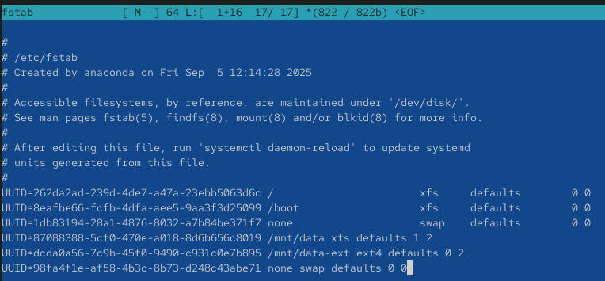{#fig-023 width=100%}

:::
::::::::::::::

## Ход работы

:::::::::::::: {.columns align=center}
::: {.column width="50%"}

Перезагружаем систему и проверяем корректность настроек.

:::
::: {.column width="50%"}

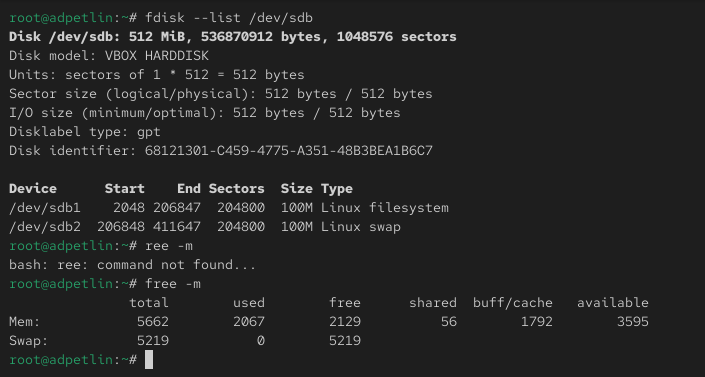{#fig-024 width=100%}

:::
::::::::::::::

# Ответы на контрольные вопросы

## Ответы на контрольные вопросы

1. Какой инструмент используется для создания разделов GUID?
Для создания разделов GPT (GUID Partition Table) используется утилита gdisk.

2. Какой инструмент применяется для создания разделов MBR?
Для создания разделов MBR (Master Boot Record) используется утилита fdisk.

3. Какой файл используется для автоматического монтирования разделов во время загрузки?
Файл /etc/fstab содержит информацию о разделах, которые должны автоматически монтироваться при загрузке системы.

4. Какой вариант монтирования целесообразно выбрать, если необходимо, чтобы файловая система не была автоматически примонтирована во время загрузки?
В файле /etc/fstab нужно указать опцию noauto для соответствующего раздела.

## Ответы на контрольные вопросы

5. Какая команда позволяет форматировать раздел с типом 82 с соответствующей файловой системой?
Для форматирования раздела подкачки (тип 82) используется команда mkswap /dev/имя_раздела.

6. Вы только что добавили несколько разделов для автоматического монтирования при загрузке. Как можно безопасно проверить, будет ли это работать без реальной перезагрузки?
Команда mount -a монтирует все разделы, указанные в /etc/fstab, что позволяет проверить корректность настроек без перезагрузки.

7. Какая файловая система создаётся, если вы используете команду mkfs без какой-либо спецификации файловой системы?
По умолчанию создается файловая система EXT2.

## Ответы на контрольные вопросы

8. Как форматировать раздел EXT4?
Команда mkfs.ext4 /dev/имя_раздела или mkfs -t ext4 /dev/имя_раздела.

9. Как найти UUID для всех устройств на компьютере?
Команда blkid отображает UUID для всех блочных устройств в системе.

# Выводы

## Выводы

Мы получили навыки создания разделов на диске и файловых систем. Мы получили навыки
монтирования файловых систем.

# Список литературы{.unnumbered}

## Список литературы{.unnumbered}

::: {.refs}
1. Колисниченко Д. Н. Самоучитель системного администратора Linux. — СПб. : БХВ-
Петербург, 2011. — (Системный администратор).
2. Neil N. J. Learning CentOS: A Beginners Guide to Learning Linux. — CreateSpace Inde-
pendent Publishing Platform, 2016.
3. Goyal S. K. Precise Guide to Centos 7: Beginners guide and quick reference. — Indepen-
dently published, 2017.
4. Unix и Linux: руководство системного администратора / Э. Немет, Г. Снайдер, Т.
Хейн, Б. Уэйли, Д. Макни. — 5-е изд. — СПб. : ООО «Диалектика», 2020.
:::

:::::::::::::: {.columns align=center}
::: {.column width="50%"}

:::
::: {.column width="50%"}

:::
::::::::::::::
